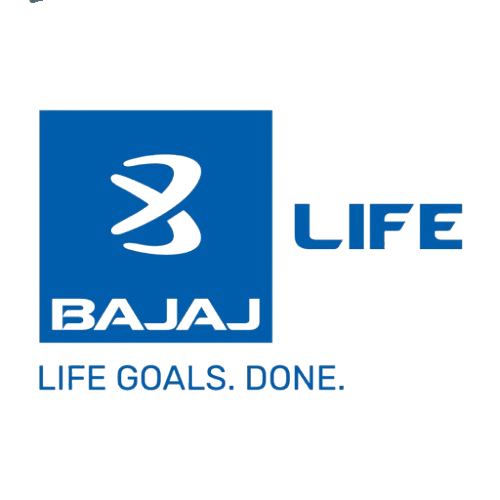
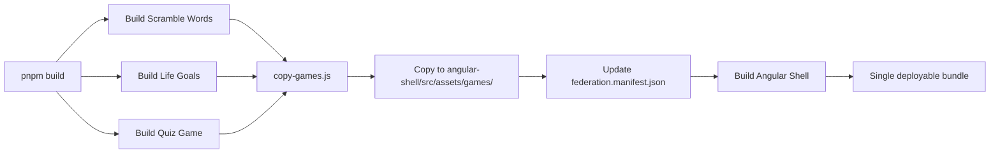

# 🎯 Life Insurance GST Quiz Game

An interactive, gamified quiz application designed to educate users about Life Insurance and GST concepts through an engaging multi-screen experience. Built with React, Vite, and modern web technologies.



## ✨ Features

### 🎮 Interactive Gameplay
- **Welcome Screen**: Stunning holographic cyberpunk-style boot sequence with animated text and visual effects
- **Goal Selection**: Choose from multiple life insurance goals to customize your quiz experience
- **Countdown Screen**: Personalized countdown before the quiz begins
- **Goal Assessment**: Interactive quiz screen with visual feedback and scoring
- **Results Screen**: Animated score display with speedometer visualization and confetti effects
- **Thank You Screen**: Post-game appreciation with booking options

### 🎨 Premium UI/UX
- **Smooth Gradient Backgrounds**: Modern navy-to-royal blue gradients
- **Responsive Design**: Optimized for both desktop and mobile devices
- **Micro-animations**: GSAP and Framer Motion powered animations
- **Interactive Elements**: Hover effects, transitions, and dynamic feedback
- **Toast Notifications**: Real-time success/feedback messages
- **Confetti Celebrations**: Canvas confetti for achievements

### 🔧 Technical Highlights
- **React 19**: Latest React with hooks and modern patterns
- **Vite**: Lightning-fast build tool and dev server
- **Tailwind CSS**: Utility-first styling with custom configurations
- **Framer Motion**: Smooth page transitions and animations
- **GSAP**: Professional-grade animation library
- **Radix UI**: Accessible component primitives
- **Lazy Loading**: Code-split screens for optimal performance

## 📦 Installation

### Prerequisites
- Node.js (v16 or higher)
- pnpm (recommended) or npm

### Setup

1. **Clone the repository**
   ```bash
   git clone <repository-url>
   cd life-goals
   ```

2. **Install dependencies**
   ```bash
   pnpm install
   # or
   npm install
   ```

3. **Start development server**
   ```bash
   pnpm dev
   # or
   npm run dev
   ```

4. **Build for production**
   ```bash
   pnpm build
   # or
   npm run build
   ```

5. **Preview production build**
   ```bash
   pnpm preview
   # or
   npm preview
   ```

## 🚀 Deployment

This project is configured for seamless deployment on Vercel:

1. **Push to GitHub**
   ```bash
   git add .
   git commit -m "Your commit message"
   git push origin main
   ```

2. **Deploy to Vercel**
   - Import your repository on [Vercel](https://vercel.com)
   - Vercel will auto-detect Vite configuration
   - Deploy with one click!

The project includes a `vercel.json` configuration for proper routing and SPA support.

## 📁 Project Structure

```
life-goals/
├── public/
│   ├── assets/          # Images, videos, and other static assets
│   └── sounds/          # Audio files for game effects
├── src/
│   ├── components/      # React components
│   │   ├── WelcomeScreen.jsx
│   │   ├── GoalSelectionScreen.jsx
│   │   ├── CountdownScreen.jsx
│   │   ├── GoalAssessmentScreen.jsx
│   │   ├── ScoreResultsScreen.jsx
│   │   ├── ThankYouScreen.jsx
│   │   ├── Speedometer.jsx
│   │   ├── Confetti.jsx
│   │   └── ui/          # Reusable UI components
│   ├── data/            # Quiz data and configurations
│   ├── hooks/           # Custom React hooks
│   │   └── useGameState.js
│   ├── utils/           # Utility functions
│   ├── lib/             # Library configurations
│   ├── App.jsx          # Main application component
│   ├── main.jsx         # Application entry point
│   └── index.css        # Global styles and Tailwind config
├── index.html           # HTML template
├── vite.config.js       # Vite configuration
├── tailwind.config.js   # Tailwind CSS configuration
├── postcss.config.js    # PostCSS configuration
└── package.json         # Dependencies and scripts
```

## 🎯 Game Flow

1. **Welcome Screen** → Animated intro with holographic effects
2. **Goal Selection** → User selects life insurance goals
3. **Countdown** → Personalized countdown with user's name
4. **Assessment** → Interactive quiz based on selected goals
5. **Results** → Score display with visual celebrations
6. **Thank You** → Option to book a slot or restart game

## 🛠️ Technologies Used

### Core
- **React 19.2.4** - UI library
- **Vite 7.2.4** - Build tool and dev server

### Styling
- **Tailwind CSS 3.4.17** - Utility-first CSS framework
- **PostCSS** - CSS processing
- **Class Variance Authority** - Component variants
- **Tailwind Merge** - Merge Tailwind classes

### Animations
- **Framer Motion 12.30.0** - Page transitions and animations
- **GSAP 3.14.2** - Advanced animations
- **Canvas Confetti 1.9.4** - Celebration effects
- **React Confetti 6.4.0** - Confetti component

### UI Components
- **Radix UI** - Accessible component primitives
  - Dialog
  - Label
  - Select
  - Slot
- **Lucide React** - Icon library
- **React Icons** - Additional icons

### Utilities
- **PropTypes** - Runtime type checking
- **clsx** - Conditional className utility

## 🎨 Design Features

- **Color Palette**: Navy blue (#142B57) to Royal blue (#2E5590) gradients
- **Typography**: Modern sans-serif fonts with proper hierarchy
- **Responsive**: Mobile-first design with media queries
- **Accessibility**: Semantic HTML and ARIA attributes
- **Performance**: Lazy loading, code splitting, optimized assets

## 📱 Mobile Optimization

- Viewport meta tags for proper mobile rendering
- Touch-friendly UI elements
- Responsive images and videos
- Optimized for various screen sizes
- No user scaling for consistent experience

## 🔄 State Management

Custom `useGameState` hook manages:
- Current screen navigation
- Selected goals tracking
- Score and lives system
- User data (name, progress)
- Toast notifications

## 🧪 Development Scripts

```bash
# Start development server
pnpm dev

# Build for production
pnpm build

# Preview production build
pnpm preview
```

## 📝 Configuration Files

- **vite.config.js** - Vite build and dev server settings
- **tailwind.config.js** - Custom Tailwind theme and utilities
- **postcss.config.js** - PostCSS plugins
- **vercel.json** - Vercel deployment configuration

## 🎓 Learning Objectives

This quiz game helps users understand:
- Life insurance concepts
- GST implications on insurance
- Financial planning basics
- Goal-based insurance selection

## 🤝 Contributing

Contributions are welcome! Please follow these steps:

1. Fork the repository
2. Create a feature branch (`git checkout -b feature/AmazingFeature`)
3. Commit your changes (`git commit -m 'Add some AmazingFeature'`)
4. Push to the branch (`git push origin feature/AmazingFeature`)
5. Open a Pull Request

## 📄 License

This project is private and proprietary.

## 👨‍💻 Author

**Abhishek**

## 🙏 Acknowledgments

- React team for the amazing library
- Vite for blazing-fast development experience
- Tailwind CSS for utility-first styling
- Framer Motion and GSAP for smooth animations
- Radix UI for accessible components

---

Made with ❤️ for better financial literacy
# README - Monolithic Master Micro-Frontend Shell

## 🎯 What Changed?

Your project is now a **monolithic pnpm workspace** - everything builds and serves from a single command!

**Before:**

- Start 4 separate servers (Angular Shell + 3 games)
- Deploy 4 separate bundles
- Complex CORS configuration

**Now:**

- ✅ Single `pnpm dev` command starts everything
- ✅ Single `pnpm build` creates one deployable bundle
- ✅ All games served from Angular Shell assets
- ✅ No CORS issues (same origin)

---

## 🚀 Quick Start

### Development

```bash
# Install dependencies for all workspace projects
pnpm install

# Start everything (Shell + all games)
pnpm dev
```

Access at: **http://localhost:4200**

Or use the convenience script:

```bash
start-dev.bat    # Windows
```

### Production Build

```bash
# Build everything into single bundle
pnpm build
```

Output: `angular-shell/dist/angular-shell/browser/`

---

## 📁 Project Structure

```
app-store/                           # pnpm workspace root
├── package.json                     # Workspace scripts
├── pnpm-workspace.yaml             # Workspace configuration
├── scripts/
│   └── copy-games.js               # Copies games to Shell assets
│
├── angular-shell/                  # Angular Shell (Host)
│   ├── src/assets/games/           # Built games copied here
│   │   ├── scramble-words/
│   │   ├── life-goals/
│   │   └── quiz-game/
│   └── src/assets/federation.manifest.json
│
├── Scramble-Words/                 # React Game 1
├── life-goals/                         # React Game 2 (life-goals)
└── quiz-game/                      # React Game 3
```

---

## 🛠 Available Commands

### Root Level (Workspace)

| Command            | Description                       |
| ------------------ | --------------------------------- |
| `pnpm install`     | Install all dependencies          |
| `pnpm dev`         | Start development (Shell + games) |
| `pnpm build`       | Build everything                  |
| `pnpm build:games` | Build only games + copy to Shell  |
| `pnpm build:shell` | Build only Angular Shell          |
| `pnpm serve`       | Serve built Shell                 |
| `pnpm clean`       | Clean all builds and dependencies |

### Individual Projects

```bash
# Work on specific project
pnpm --filter angular-shell dev:serve
pnpm --filter scramble-words build
pnpm --filter life-goals test
```

---

## 🏗 How Monolithic Build Works

### Build Process



1. **pnpm build:games**
   - Builds all 3 React games
   - Runs `copy-games.js` script
   - Copies builds to `angular-shell/src/assets/games/`
   - Updates manifest to use `/assets/games/*` paths

2. **pnpm build:shell**
   - Builds Angular Shell
   - Includes all game bundles in assets
   - Creates single `dist/` folder

3. **Result**
   - One folder to deploy
   - All games accessible from `/assets/games/`
   - No separate game servers needed

### Federation Manifest

**Development manifest** (auto-updated by `copy-games.js`):

```json
{
  "scramble-words": {
    "remoteEntry": "/assets/games/scramble-words/index.js"
  }
}
```

All paths are relative to the Angular Shell - no external URLs!

---

## 🚢 Deployment

### Option 1: Docker

```bash
docker build -t microfrontend-shell .
docker run -p 80:80 microfrontend-shell
```

### Option 2: Static Hosting

```bash
pnpm build
cd angular-shell/dist/angular-shell/browser
# Upload this folder to your hosting
```

### Option 3: Nginx

```bash
pnpm build
cp -r angular-shell/dist/angular-shell/browser/* /var/www/html/
# Use the included nginx.conf
```

---

## 📊 Workspace Configuration

### pnpm-workspace.yaml

```yaml
packages:
  - "angular-shell"
  - "Scramble-Words"
  - "life-goals"
  - "quiz-game"
```

### Package Names

- `angular-shell` - Angular Shell
- `scramble-words` - Game 1
- `life-goals` - Game 2
- `quiz-game` - Game 3

---

## 🔧 Development Workflow

### Typical Development Session

```bash
# 1. Install dependencies (first time only)
pnpm install

# 2. Start development
pnpm dev

# 3. Make changes to any project
# - Changes hot-reload automatically
# - Games load from localhost dev servers
# - Shell serves on port 4200

# 4. Build for production
pnpm build

# 5. Test production build locally
pnpm serve:prod
```

### Working on a Single Game

```bash
# Just work on Life Goals
cd life-goals
pnpm dev

# In another terminal, run Shell
cd angular-shell
pnpm dev:serve
```

---

## 🎮 Testing

### Local Testing

```bash
# Start everything
pnpm dev

# Visit
# - http://localhost:4200 (Lobby)
# - http://localhost:4200/play/life-goals
# - http://localhost:4200/play/scramble-words
# - http://localhost:4200/play/quiz-game
```

### Production Build Testing

```bash
# Build
pnpm build

# Serve production build
cd angular-shell
pnpm serve:prod

# Visit http://localhost:4200
```

---

## 📦 What Gets Built

### Production Output

```
angular-shell/dist/angular-shell/browser/
├── index.html
├── main.*.js
├── polyfills.*.js
├── assets/
│   ├── federation.manifest.json
│   └── games/
│       ├── scramble-words/
│       │   ├── index.html
│       │   ├── index.js
│       │   └── assets/
│       ├── life-goals/
│       │   ├── index.html
│       │   ├── index.js
│       │   └── assets/
│       │       └── videos/ (9 MP4s)
│       └── quiz-game/
│           ├── index.html
│           ├── index.js
│           └── assets/
```

**Total size**: ~50-100MB (includes all videos)

---

## ✨ Benefits

### Development

- ✅ Single command to start everything
- ✅ Automatic hot-reload for all projects
- ✅ No CORS configuration needed
- ✅ Shared dependencies via workspace

### Production

- ✅ One folder to deploy
- ✅ All assets from same origin
- ✅ Simplified CDN configuration
- ✅ Better caching strategy

### Maintenance

- ✅ Unified dependency management
- ✅ Single version control
- ✅ Consistent build process
- ✅ Easy to add new games

---

## 🆕 Adding New Games

1. Create game in workspace root:

```bash
cd app-store
pnpm create vite new-game --template react
```

2. Add to `pnpm-workspace.yaml`:

```yaml
packages:
  - "new-game"
```

3. Build will automatically include it!

---

## 🔍 Troubleshooting

### "Module not found" errors

```bash
pnpm install
```

### Games not showing in Shell

```bash
pnpm build:games
```

### Build fails

```bash
pnpm clean
pnpm install
pnpm build
```

### Port already in use

- Kill process on port 4200
- Or change port in `angular-shell/package.json`

---

## 📚 Documentation

- [QUICKSTART.md](QUICKSTART.md) - Quick reference
- [DEPLOYMENT.md](DEPLOYMENT.md) - Detailed deployment guide
- [Walkthrough](brain/.../walkthrough.md) - Architecture details

---

## 🎉 You're Ready!

```bash
pnpm install
pnpm dev
```

Visit **http://localhost:4200** and enjoy your monolithic micro-frontend shell!
